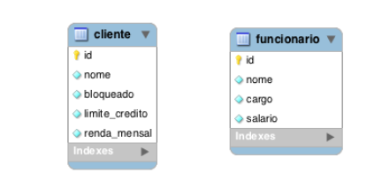

# Criar um sistema para gestão Escolar

## Criar POJO [ok]/DAO[?]

- Empresa [ok][ok]
- unidades escolares [ok]
- Aluno[ok]
- Professor[ok]
- Cursos oferecidos [ok]
- Períodos dos cursos [ok]
- Disciplinas oferecidas [ok]

## Criar

## Tecnologias

- Java
- JPA
- Hibernate
- MySQL
- Maven

## Java Persistence API  e Hibernate

AJava Persistence API (JPA) ou Jakarta Persistence (novo nome adotado pelo Jakarta EE) é uma especificação que oferece uma API de mapeamento objeto-relacional, ou seja, é a tecnologia padrão em Java para trabalhar com ORM.

## Informações projeto inicial

- pom: arquivo criado no diretório raiz do projeto.Esse arquivo contém informações sobre o projeto e detalhes de configurações usadas para o Maven fazer build do projeto.

Para trabalhar com JPA temos que adicionar algumas dependencias no pom.xml.

Devemos incluí-las nas tags dependencies:

```

<dependencies>

    <!-- https://mvnrepository.com/artifact/mysql/mysql-connector-java -->
    <dependency>
        <groupId>mysql</groupId>
        <artifactId>mysql-connector-java</artifactId>
        <version>8.0.30</version>
    </dependency>

    <dependency>
        <groupId>org.hibernate</groupId>
        <artifactId>hibernate-entitymanager</artifactId>
        <version>5.4.27.Final</version>
    </dependency>

</dependencies>


```

O Maven baixa automaticamente os JARs das dependências pela internet, do repositório central.

Ao adicionar a implementação do Hibernate como dependência, estamos automaticamente adicionando também o JPA, que é uma dependência transitiva do Hibernate (o Hibernate depende do JPA, portanto “carrega” junto essa dependência, que é chamada de dependência transitiva).

## Criando o Domain Model

Modelos de domínio para o sistema de gestão escolar.

Serão Criadas 7 classes POJO:

- Aluno
- Curso
- Disciplina
- Empresa
- PeriodoCurso
- Professor
- Unidade

Todas essas classes possuirão um atributo identificador.

O atributo identificador (chamado de id) é referente a chave primária das tabelas.

As classes de entidades podem seguir o estilo JavaBeans, com métodos getters e setteres. é obrigatório que essas

classes tenham um construtor sem argumentos.

Todas essas classes são POJO(Plain Old **Java** Object ), ou seja podemos instanciá-las sem necessidade de containers especiais.

## Implementando o equals() e hashCode()

Para que os objetos das entidades sejam diferenciados uns de outros, precisamos implementar os métodos equals() e hashCode().

Nobanco de dados, as chaves primárias diferenciam registros distintos. Quando mapeamos uma entidade para uma tabela, devemos criar os métodos equals() e hashCode(), levando em consideração a forma em que os registros são diferenciados no banco de dados.

## Mapeamento básico

Para que o mapeamento objeto-relacional funcione, é encessário implementar do JPA mais detalhes sobre como objetos das classes devem se tornar persistentes, ou seja como as instancias dessas  classe podem ser  gravadas e consultadas no BD. Podemos anotar os getters ou atributos, ou até mesmo a própria classe, com anotações do JPA.

As anotações são padronizadas são importadas do javax.persistence. Dentro desse pacote estão todas as anotações padronizadas pela JPA.

Exemplos anotações:

- @Entity: diz que a classe é uma entidade JPA, que representa uma tabela do banco de dados.

  As anotações nos atributos configuram a relação com as colunas da tabela do banco de dados.
- @Id: é usada para declarar o identificador da entidade, ou seja, representa a chave primária na tabela do banco de dados.
- @GeneratedValue:especifica que um valor será gerado automaticamente para este atributo.

  - GenerationType.AUTO: Valor padrão, deixa com o provedor de persistência a escolha da estratégia mais adequada de acordo com o banco de dados.
  - GenerationType.IDENTITY:Informamos ao provedor de persistência que os valores a serem atribuídos ao identificador único serão gerados pela coluna de auto incremento do banco de dados. Assim, um valor para o identificador é gerado para cada registro inserido no banco. Alguns bancos de dados podem não suportar essa opção.
  - GenerationType.SEQUENCE: Informamos ao provedor de persistência que os valores serão gerados a partir de uma sequence. Caso não seja especificado um nome para a sequence, será utilizada uma sequence padrão, a qual será global, para todas as entidades. Caso uma sequence seja especificada, o provedor passará a adotar essa sequence para criação das chaves primárias. Alguns bancos de dados podem não suportar essa opção.
  - GenerationType.TABLE: Com a opção TABLE é necessário criar uma tabela para gerenciar as chaves primárias. Por causa da sobrecarga de consultas necessárias para manter a tabela atualizada, essa opção é pouco recomendada.
- @Colun:especifica que a propriedade da classe representa uma coluna na tabela do banco de dados.
- @Table:podemos especificar o nome da tabela, senão especificarmos ela considera o nome da classe.
- @Column(length = 60, nullable = false):Definimos o tamanho da coluna com 60 e com restrição not null.

Ao omitir a anotação Column nas outras propriedades, o JPA faz o mapeamento automaticamente, o que significa que todas as propriedades da classe estão mapeadas para colunas.

## O arquivo persistence.xml

O persistence.xml é um arquivo de configuração padrão da JPA. Ele deve ser criado no diretório META-INF da aplicação ou do módulo que contém as classes de entidade.

```
<?xml version="1.0" encoding="UTF-8"?>
<persistence version="2.2"
             xmlns="http://xmlns.jcp.org/xml/ns/persistence"
             xmlns:xsi="http://www.w3.org/2001/XMLSchema-instance"
             xsi:schemaLocation="http://xmlns.jcp.org/xml/ns/persistence http://xmlns.jcp.org/xml/ns/persistence/persistence_2_2.xsd">

    <persistence-unit name="sistema" >
        <provider>org.hibernate.ejb.HibernatePersistence</provider>


        <properties>
            <property name="javax.persistence.jdbc.driver" value="com.mysql.cj.jdbc.Driver"/>
            <property name="javax.persistence.jdbc.url" value="jdbc:mysql://localhost:3306/sistema?serverTimezone=UTC"/>
            <property name="javax.persistence.jdbc.user" value="root"/>
            <property name="javax.persistence.jdbc.password" value="123456"/>

            <property name="hibernate.dialect" value="org.hibernate.dialect.MySQL8Dialect"/>
            <property name="hibernate.show_sql" value="true"/>
            <property name="hibernate.hbm2ddl.auto" value="update"/>
            <property name="hibernate.format_sql" value="true" />
        </properties>
    </persistence-unit>

</persistence>
```

Onomedaunidadedepersistênciafoidefinido como sistema.

## Criação de Tabelas

O JPA pode criar as tabelas devido a inclusão da propriedade javax.persistence.schemageneration.database.action com valor drop-and-create, que incluímos no arquivo persistence.xml.

Nesse caso eu exclui a properti porque não tenho schema :

```
<property name="javax.persistence.schema-generation.database.action" value="drop-and-create"/>
```

Precisamos apenas obter uma instância de EntityManagerFactory para dar um start no mecanismo do JPA. Assim, todas as tabelas mapeadas pelas entidades serão criadas.

```
public class JPAUtil {

    /**
     * Método utilizado para obter o entity manager.
     * @return
     */
    private static EntityManagerFactory factory;
    static {
        factory = Persistence.createEntityManagerFactory("sistema");
    }
    public static EntityManager getEntityManager() {
        return factory.createEntityManager();
    }
    public static void close() {
        factory.close();
    }

}
```

O parâmetro do método createEntityManagerFactory deve ser o mesmo nome que informamos no atributo name da tag persistence-unit, no arquivo persistence.xml.

Quando executarmos esse código a tabela é criada

- Podemosdefinir melhor os detalhes físicos no mapeamento de nossa entidade, definindo quantidade de caracteres, se é nulo e outros
- length: quantidade de caracteres
- nullable: que o campo pode ou não ser nulo.

## EntityManager

Os sistemas que usam JPA precisam de apenas uma instância de EntityManagerFactory, que pode ser criada durante a inicialização da aplicação. Esta única instância pode ser usada por qualquer código que queira obter um EntityManager.

Um EntityManager é responsável por gerenciar entidades no contexto de persistência. Através dos métodos dessa interface, é possível persistir, pesquisar e excluir objetos do banco de dados.

Criamos um bloco estático para inicializar a fábrica de Entity Manager. Isso ocorrerá apenas uma vez, no carregamento da classe. Agora, sempre que precisarmos de uma EntityManager, podemos chamar: EntityManager manager = JPAUtil.getEntityManager();

public class JPAUtil {

/**

* Método utilizado para obter o entity manager.
* @return
  */
  private static EntityManagerFactory factory;
  static {
  factory = Persistence.createEntityManagerFactory("sistema");
  }
  public static EntityManager getEntityManager() {
  return factory.createEntityManager();
  }
  public static void close() {
  factory.close();
  }
  }

## Persistindo Objetos

Exemplo de código:

```
public class PersisntindoEmpresa {
    public static void main(String[] args) {

        EntityManager em= JPAUtil.getEntityManager();
        EntityTransaction tx=em.getTransaction();
        tx.begin();

        Unidade unidade= new Unidade();
        unidade.setNome("Centro");
        unidade.setEndereco("Rua Francisco de Assis");
        Empresa empresa= new Empresa("Etapa", Arrays.asList(unidade));

        em.persist(empresa);

        tx.commit();

        em.close();
        JPAUtil.close();
    }
}

```

O Hibernate gera o SQL de inserção por que incluimos a configuração no persistence.xml

O código abaixo obtém um EntityManager, que é responsável por gerenciar o ciclo de vida das entidades.

EntityManager manager = JpaUtil.getEntityManager();

Agora iniciamos uma nova transação.

EntityTransaction tx = manager.getTransaction();

tx.begin();

Instanciamos os objetos e atribuimos valores, chamando getteres e setters.

Executamos o método persist, passando a instância da empresa como parâmetro. Isso fará com que o JPA insira o objeto no banco de dados.

```
 em.persist(empresa);
```

Agora fazemos commit da transação, para efetivar a inserção da empresa no banco de dados.

tx.commit();

fechamos o EntityManager e o EntityManagerFactory.

manager.close();

JpaUtil.close();

SQL e JDBC continuam sendo usados por baixo dos panos, pela implementação do JPA.

## Buscando objetos pelo identificador

Podemos recuperar objetos através do identificador (chave primária) da entidade.

consultamos a instância da empresa usando o método find, de EntityManager, passando como argumento o tipo da entidade e também o código da empresa.

```


        public Empresa findById(Long id){


            Empresa empresa=null;

            try{
                //consulta uma empresa por ID
                empresa= em.find(Empresa.class,id);
                System.out.println("Dados empresa:"+empresa.getId()+ "- "+empresa.getNome());

        }finally {
          //      em.close();
            }
        return empresa;
    }
```

```
disciplinaDAO.findById(1l);
```

Se rodarmos o código o SQL gerado possui a cláusula where, para filtrar apenas o veículo de código igual a 1.

- Podemos também buscar um objeto pelo identificador usando o método getReference.

  ```

      public Empresa findById2(Long id){

          Empresa empresa=null;

          try {
             empresa=em.getReference(Empresa.class,id);
              System.out.println("Id:"+ empresa.getId()+" Nome: "+empresa.getNome());
          }catch (Exception e){
              System.err.println(e);
              System.out.println("Id :"+id + " não localizado no nosso BD!");
          }finally {

          }
          return empresa;
      }

  ```

```
    empresaDAO.findById2(2L);

```

O resultado na console é o mesmo, deixando a impressão que os métodos find e getReference fazem a mesma coisa, mas na verdade, esses métodos possuem comportamentos um pouco diferentes.

O método find busca o objeto imediatamente no banco de dados, enquanto getReference só executa o SQL quando o objeto for usado pela primeira vez, ou O método find busca o objeto imediatamente no banco de dados, enquanto getReference só executa o SQL quando o objeto for usado pela primeira vez.

Note que o SQL foi executado apenas quando um getter foi invocado, e não na chamada de getReference.

A JPQL é uma extensão da SQL, porém com características da orientação a objetos. Com essa linguagem, não referenciamos tabelas do banco de dados, mas apenas entidades de nosso modelo.

SELECT * FROM empresa

Fica da seguinte forma em JPQL:

SELECT e from Empresa e

## Listando objetos

consultas simples de entidades com a linguagem JPQL (Java Persistence Query Language).

A JPQL é uma extensão da SQL, porém com características da orientação a objetos. Com essa linguagem, não referenciamos tabelas do banco de dados, mas apenas entidades de nosso modelo.

## Atualizando Objetos

Os atributos de entidades podem ser manipulados diretamente ou através dos métodos da classe e todas as alterações serão detectadas e persistidas automaticamente, quando o contexto de persistência for “descarregado” para o banco de dados.

```


    public Empresa update(Long id, String empre) {

        Empresa empresa =null;

        try{
            //inicia uma transação no banco de dados
            em.getTransaction().begin();


            System.out.println("Atualizando empresa");
            empresa=em.find(Empresa.class,id);

            System.out.println("Dado atual :"+empresa.getId()+" - "+empresa.getNome());
            empresa.setNome(empre);
            System.out.println("Dado Novo: "+empresa.getId()+" - "+empresa.getNome());

            em.getTransaction().commit();

        } catch (Exception e){
            System.out.println("Erro na atualização!");
            System.err.println(e);

        }
        finally{
            // em.close();
        }
        return empresa;
    }

```

O código acima executa o comando select no banco de dados para buscar a empresa pelo id, imprime o nome atual da empresa e atribui um novo nome a empresa.

não precisamos chamar nenhum método para a atualização no banco de dados. A alteração foi identificada automaticamente e refletida no banco de dados, através do comando SQL update.

Atualizando empresa
Hibernate:
select
empresa0_.id_empresa as id_empre1_4_0_,
empresa0_.nome_empresa as nome_emp2_4_0_
from
tab_empresa empresa0_
where
empresa0_.id_empresa=?
Dado atual :2 - Juscelino Kubtheck
Dado Novo: 2 - Flavio Tavares
Hibernate:
update
tab_empresa
set
nome_empresa=?
where
id_empresa=?

## Excluindo objetos

A exclusão de objetos é feita chamando o método remove de EntityManager, passando como parâmetro o objeto da entidade.

- Estados e ciclo de vida

## Gerenciando Estados

Objetos de entidades são instâncias de classes mapeadas usando JPA, que ficam na memória e representam registros do banco de dados. Essas instâncias possuem um ciclo de vida, que é gerenciado pelo JPA.

Os estados do ciclo de vida das entidades são: transient (ou new), managed,
detached e removed.



As transições entre os estados são feitas através de métodos do EntityManager.

- Objetos transientes (transient) são instanciados usando o operador new. Isso significa que eles ainda não estão associados com um registro na tabela do
  banco de dados e qualquer alteração em seus dados não afeta o estado no banco
  de dados.
- Objetos gerenciados (managed) são instâncias de entidades que possuem um
  identificador e representam um registro da tabela do banco de dados.
  As instâncias gerenciadas podem ser objetos que foram persistidos através da
  chamada de um método do EntityManager, como por exemplo o persist.
  Eles também podem ter se tornado gerenciados através de métodos de consulta
  do EntityManager, que buscam registros da base de dados e instanciam objetos
  diretamente no estado managed.
  Objetos gerenciados estão sempre associados a um contexto de persistência,
  portanto, quaisquer alterações nesses objetos são sincronizadas com o banco de
  dados.
- Objetos removidos: Uma instância de uma entidade pode ser excluída através do método remove do EntityManager. Um objeto entra no estado removed quando ele é marcado para ser eliminado, masé fisicamente excluído durante a sincronização com o banco de dados.
- Objetos desanexados: Um objeto sempre inicia no estado transiente e depois pode se tornar gerenciado.Quando o EntityManager é fechado, continua existindo uma instância do objeto, mas já no estado detached. Esse estado existe para quando os objetos estão desconectados, não tendo mais sincronia com o banco de dados.

## Contexto de Peristencia

O contexto de persistência é uma coleção de objetos gerenciados por um
EntityManager.

Se uma entidade é pesquisada, mas ela já existe no contexto de persistência,
o objeto existente é retornado sem acessar o banco de dados. Esse recurso é
chamado de cache de primeiro nível.

Uma mesma entidade pode ser representada por diferentes objetos na memória,
desde que seja em diferentes instâncias de EntityManagers.

Em uma única instância de EntityManager, apenas um objeto que representa
determinada entidade (com o mesmo identificador) pode ser gerenciada.

O método contains de EntityManager verifica se o objeto está sendo gerenciado
pelo contexto de persistência do EntityManager.

O método detach para de gerenciar a entidade no contexto de persistência,
colocando ela no estado detached

## Sincronização de dados

Os estados de entidades são sincronizados com o banco de dados quando ocorre
o commit da transação associada.

## Salvando Objetos desanexados com merge()

Objetos desanexados são objetos em um estado que não é gerenciado pelo
EntityManager, mas ainda representam entidades no banco de dados.

As alterações em objetos desanexados não são sincronizadas com o banco de
dados.

Quando estamos desenvolvendo com JPA, existem diversos momentos que
somos obrigados a trabalhar com objetos desanexados, por exemplo, quando eles
são expostos para alteração através de páginas web e apenas em um segundo
momento o usuário solicita a gravação das alterações do objeto.

## Mapeamento

## Identificadores

A propriedade de identificação mapeia a chave primária de uma tabela do banco
de dados.

@Id
@GeneratedValue(strategy = GenerationType.AUTO)
@Column(name = "cod_empresa")
private Long codigo;

A anotação @Id marca o atributo como um identificador.

Já a anotação @GeneratedValue sem uma estratégia especificada, permite a
implementação, que no caso é o Hibernate, escolher a forma como a chave será
gerada.

- @GeneratedValue: Quando essa propriedade não é informada, é considerada a
  estratégia AUTO como padrão.
-
-
- GenerationType.IDENTITY: Essa estratégia pode ser escolhida quando o banco de dados tem a capacidade de autoincrementar o valor da chave primaria. No caso do MySQL, estamos falando em ter a coluna da chave primaria com auto_increment.

  ## Chaves compostas

  `@Embeddable`anotação sobre uma classe define que, ela não tem existência independente. Assim, não podemos executar consultas de banco de dados, sem depender de outra classe.

  **A JPA fornece a anotação *@Embeddable*  para declarar que uma classe será incorporada por outras entidades.**
- **A anotação JPA *@Embedded* é usada para incorporar um tipo em outra entidade.**

  Ex: 

  ## Enumerações

  Enumerações em Java é um tipo que define um número finito de valores
  (instâncias), como se fossem constantes.

O novo atributo foi mapeado como uma coluna normal, porém incluímos a anotação @Enumerated, para configurar o tipo da enumeração como string.
Fizemos isso para que a coluna do banco de dados armazene o nome da
constante, e não o número que representa a opção na enumeração.

## Propriedades temporais

Para utilizar a “nova” API de datas do Java com LocalDate, LocalDateTime e
LocalTime, não é preciso nada de especial.

Basta criar a propriedade com o tipo da precisão desejada.

@Column(name = "data_cadastro", nullable = false)
private LocalDate dataCadastro;

Veja abaixo um atributo com o tipo Date equivalente ao exemplo anterior.

@Temporal(TemporalType.DATE)
@Column(name = "data_cadastro", nullable = false)
private Date dataCadastro;

A JPA não define a precisão que deve ser usada se @Temporal não for especificada,
mas quando usamos Hibernate, as propriedades de datas usam a definição
TemporalType.TIMESTAMP por padrão. Outras opções são TemporalType.TIME e
TemporalType.DATE.

Para ter uma ideia melhor, LocalDate é equivalente a TemporalType.DATE,
LocalDateTime equivale a TemporalType.TIMESTAMP e LocalTime é
TemporalType.TIME.

## Propriedades transientes

As propriedades de uma entidade são automaticamente mapeadas se não
especificarmos nenhuma anotação.

Por diversas vezes, podemos precisar criar atributos que não representam uma
coluna no banco de dados. Nestes casos, devemos anotar com @Transient.

@Transient
private String descricaoCompleta;

A propriedade será ignorada totalmente pelo mecanismo de persistência.

## Objetos grandes

Quando precisamos armazenar muitos dados em uma coluna, por exemplo um
texto longo, um arquivo qualquer ou uma imagem, mapeamos a propriedade
com a anotação @Lob.

Objeto grande em caracteres (CLOB)

Um CLOB (Character Large Object) é um tipo de dado em bancos de dados que
pode armazenar objetos grandes em caracteres (textos muito longos).

Para mapear uma coluna CLOB em JPA, definimos uma propriedade com o tipo
String, char[] ou Character[] e anotamos com @Lob.

public class Veiculo {
// outros atributos
@Lob
private String especificacoes;
// getters e setters
// equals e hashCode
}

A coluna criada na tabela é do tipo LONGTEXT, que é um tipo de CLOB do MySQL.


## Associações um-para-um

O relacionamento um-para-um, também conhecido como one-to-one, pode ser
usado para dividir uma entidade em duas (criando duas tabelas), para ficar mais
normalizado e organizado.

Esse tipo de associação poderia ser usado entre Veiculo e Proprietario.


Precisamos apenas anotar a classe Proprietario com @Entity e, opcionalmente,
@Table.

Na classe Empresa, adicionamos a propriedade empreda e mapeamos com
@OneToOne.

public class Empresa {
// outros atributos

@OneToOne
private Unidade unidade;

// getters e setters
// equals e hashCode
}

Note que foi criada uma coluna unidade_id na tabela tab_veiculo.

Por padrão, o nome da coluna é definido com o nome do atributo da associação,
mais underscore, mais o nome do atributo do identificador da entidade destino.
Podemos mudar isso com a anotação @JoinColumn.

Por padrão, o nome da coluna é definido com o nome do atributo da associação,
mais underscore, mais o nome do atributo do identificador da entidade destino.
Podemos mudar isso com a anotação @JoinColumn.

@OneToOne
@JoinColumn(name = "cod_unidade")
private Unidade unidade;

O relacionamento one-to-one aceita referências nulas, por padrão. Podemos
obrigar a atribuição de proprietário durante a persistência de Veiculo, incluindo
o atributo optional com valor false na anotação @OneToOne.

@OneToOne(optional = false)
@JoinColumn(name = "cod_unidade")
private Unidade unidade;

Agora se tentarmos persistir uma unidade semempresa , uma exceção será lançada

## Associação bidirecional

A associação que fizemos entre Veiculo e Proprietario é unidirecional, ou seja,
podemos obter o proprietário a partir de um veículo, mas não conseguimos obter o veículo a partir de um proprietário.

Para tornar a associação um-para-um bidirecional e então conseguirmos obter
a Empresa a partir de uma unidade, precisamos apenas incluir uma nova
propriedade na classe PEmpresa e mapear com @OneToOne usando o atributo
mappedBy.

@Entity
@Table(name = "empresa")
public class Empresa {
// outros atributos

@OneToOne(mappedBy = "empresa")
private Unidade unidade;

// getters e setters
// equals e hashCode
}

O valor de mappedBy deve ser igual ao nome da propriedade na classe Unidade que
associa com Empresa.

## Associações muitos para um - @ManyToMany

Na última seção, mapeamos o atributo empresa na entidade Veiculo com
um-para-um. Mudaremos o relacionamento agora para many-to-one. Dessa

forma, um veículo poderá possuir apenas um proprietário, mas um proprietário
poderá estar associado a muitos veículos.


public class Unidade {
// outros atributos
@ManyToOne
@JoinColumn(name = "empresa_id")
private Empresa empresa;
// getters e setters
// equals e hashCode
}

A anotação @ManyToOne indica a multiplicidade do relacionamento entre unidade e
empresa.

## Coleções um-para-muitos

A anotação @OneToMany deve ser utilizada para mapear coleções.,,

Mapearemos o inverso da associação many-to-one, que fizemos na última seção,
indicando que um proprietário pode ter muitos veículos.


Incluiremos o atributo veiculos na entidade Proprietario, do tipo List<Veiculo>.

public class Proprietario {
// outros atributos

@OneToMany(mappedBy = "proprietario")
private List<Veiculo> veiculos;

// getters e setters
// equals e hashCode
}

## Coleções muitos-para-muitos


Esse tipo de relacionamento precisará de uma tabela de associação para que a
multiplicidade muitos-para-muitos funcione. O recurso de schema generation do
JPA poderá recriar as tabelas automaticamente.

Por padrão, um mapeamento com @ManyToMany cria a tabela de associação com os
nomes das entidades relacionadas, separados por underscore, com as colunas com
nomes também gerados automaticamente.
Podemos customizar o nome da tabela de associação e das colunas com a
anotação @JoinTable.

@ManyToMany
@JoinTable(name = "veiculo_acessorio",
joinColumns = @JoinColumn(name = "veiculo_codigo"),
inverseJoinColumns = @JoinColumn(name = "acessorio_codigo"))
private Set<Acessorio> acessorios = new HashSet<>();

Neste exemplo, definimos o nome da tabela de associação como
veiculo_acessorio, o nome da coluna que faz referência para a tabela de veículos
como veiculo_codigo e da coluna que referencia a tabela de acessórios como
acessorio_codigo (lado inverso).

## Mapeamento bidirecional

Para fazer o mapeamento bidirecional, o lado inverso deve apenas fazer
referência ao nome da propriedade que mapeou a coleção na entidade dona da
relação, usando o atributo mappedBy.

public class Acessorio {
// outros atributos
@ManyToMany(mappedBy = "acessorios")
private Set<Veiculo> veiculos = new HashSet<>();
// getters e setters
// equals e hashCode
}

## Coleções de tipos básicos e objetos embutidos

Em algumas situações, não precisamos criar e relacionar duas entidades, pois
uma coleção de tipos básicos ou embutíveis seria suficiente. Para esses casos,
usamos @ElementCollection.

Para nosso exemplo, voltaremos a usar a entidade Proprietario. Um proprietário
pode ter vários números de telefones, que são do tipo String. Tudo que
precisamos é de um List<String>.

@Entity
@Table(name = "proprietario")
public class Proprietario {
@Id

@GeneratedValue(strategy = GenerationType.IDENTITY)
private Long codigo;
@Column(name = "nome", length = 60, nullable = false)
private String nome;
@Column(length = 255)
private String email;
@ElementCollection
@CollectionTable(name = "proprietario_telefone",
joinColumns = @JoinColumn(name = "proprietario_codigo"))
@Column(name = "telefone_numero", length = 20, nullable = false)
private List<String> telefones = new ArrayList<>();
// getters e setters
// hashCode e equals

}

A tabela que armazena os dados da coleção foi customizada através da anotação
@CollectionTable.

Personalizamos também o nome da coluna que faz referência à tabela de
proprietário usando a propriedade joinColumns.

A anotação @Column foi usada para personalizar o nome da coluna que armazena
o número do telefone na tabela da coleção.

## Herança

Mapear herança de classes que representam tabelas no banco de dados pode ser
uma tarefa complexa e nem sempre pode ser a melhor solução. Use este recurso
com moderação. Muitas vezes é melhor você mapear usando associações do que
herança.

A JPA define 3 formas de se fazer o mapeamento de herança:
• Tabela única para todas as classes (single table)
• Uma tabela para cada classe da hierarquia (joined)
• Uma tabela para cada classe concreta (table per class)

Tabela única para todas as classes

Essa estratégia de mapeamento de herança é a melhor em termos de performance
e simplicidade, porém seu maior problema é que as colunas das propriedades
declaradas nas classes filhas precisam aceitar valores nulos.

A falta da constraint NOT NULL pode ser um problema sério no ponto de vista de
integridade de dados.

Para implementar essa estratégia, criaremos uma classe abstrata Pessoa.

@Entity
@Table(name = "pessoa")
@Inheritance(strategy = InheritanceType.SINGLE_TABLE)
@DiscriminatorColumn(name = "tipo")

public abstract class Pessoa {

@Id
@GeneratedValue(strategy = GenerationType.IDENTITY)
private Long codigo;

@Column(length = 100, nullable = false)
private String nome;
// getters e setters
// hashCode e equals
}

Definimos a estratégia SINGLE_TABLE com a anotação @Inheritance. Esse tipo de
herança é o padrão, ou seja, não precisaríamos anotar a classe com @Inheritance,
embora seja melhor deixar explícito para facilitar o entendimento.

A anotação @DiscriminatorColumn foi usada para informar o nome de coluna de
controle para discriminar de qual classe é o registro.

Agora, criaremos as subclasses Cliente e Funcionario.

@Entity
@DiscriminatorValue("C")
public class Cliente extends Pessoa {
@Column(name = "limite_credito", nullable = true)
private BigDecimal limiteCredito;
@Column(name = "renda_mensal", nullable = true)
private BigDecimal rendaMensal;
@Column(nullable = true)
private boolean bloqueado;
// getters e setters
}

@Entity
@DiscriminatorValue("C")
public class Cliente extends Pessoa {
@Column(name = "limite_credito", nullable = true)
private BigDecimal limiteCredito;
@Column(name = "renda_mensal", nullable = true)
private BigDecimal rendaMensal;
@Column(nullable = true)
private boolean bloqueado;
// getters e setters
}

@Entity
@DiscriminatorValue("F")
public class Funcionario extends Pessoa {

@Column(nullable = true)
private BigDecimal salario;
@Column(length = 60, nullable = true)
private String cargo;
// getters e setters
}

As subclasses foram anotadas com @DiscriminatorValue para definir o valor
discriminador de cada tipo.

Veja a única tabela criada, que armazena os dados de todas as subclasses.


Uma tabela para cada classe da hierarquia

Outra forma de fazer mapeamento de herança é usar uma tabela para cada classe
da hierarquia (subclasses e superclasse).

Alteramos a estratégia de herança para JOINED na entidade Pessoa.

@Entity
@Table(name = "pessoa")
@Inheritance(strategy = InheritanceType.JOINED)
public abstract class Pessoa {
// atributos
// getters e setters
// equals e hashCode
}

Nas classes Cliente e Funcionario, podemos adicionar a anotação
@PrimaryKeyJoinColumn para informar o nome da coluna que faz referência à
tabela pai, ou seja, o identificador de Pessoa. Se o nome dessa coluna for igual ao
nome da coluna da tabela pai, essa anotação não precisa ser utilizada.

@Entity

@Table(name = "funcionario")
@PrimaryKeyJoinColumn(name = "pessoa_codigo")
public class Funcionario extends Pessoa {
// atributos
// getters e setters
}

@Entity
@Table(name = "cliente")
@PrimaryKeyJoinColumn(name = "pessoa_codigo")
public class Cliente extends Pessoa {
// atributos
// getters e setters
}

Este tipo de mapeamento criará 3 tabelas.


A parte de persistência das duas entidades pode ficar da mesma forma que você
já viu anteriormente. Não muda.O que vai mudar é a estrutura das tabelas no banco de dados.

Uma tabela para cada classe concreta

Uma outra opção de mapeamento de herança é ter tabelas apenas para classes
concretas (subclasses). Cada tabela deve possuir todas as colunas, incluindo as da
superclasse

Para utilizar essa forma de mapeamento, devemos anotar a classe Pessoa da
maneira apresentada abaixo:

@Entity
@Inheritance(strategy = InheritanceType.TABLE_PER_CLASS)
public abstract class Pessoa {
@Id
@GeneratedValue(generator = "inc")
@GenericGenerator(name = "inc", strategy = "increment")
private Long codigo;
// outros atributos
// getters e setters
// equals e hashCode
}

Tivemos que mudar a estratégia de geração de identificadores “increment”, que
a implementação do Hibernate disponibiliza (não é padronizada pelo JPA). Não
podemos usar a geração automática de chaves nativa do banco de dados.
Também não precisamos mais da anotação @PrimaryKeyJoinColumn. Pode removêla
das entidades Cliente e Funcionario.

@Entity
@Table(name = "cliente")
public class Cliente extends Pessoa {
// atributos
// getters e setters

}
@Entity
@Table(name = "funcionario")
public class Funcionario extends Pessoa {
// atributos
// getters e setters
}

Veja a estrutura das tabelas criadas:


Herança de propriedades da superclasse

Pode ser útil em algumas situações compartilhar propriedades através de uma
superclasse, sem considerá-la como uma entidade mapeada. Para isso, podemos
usar a anotação @MappedSuperclass.

@MappedSuperclass
public abstract class Pessoa {

@Id
@GeneratedValue(strategy = GenerationType.IDENTITY)
private Long codigo;
// outros atributos
// getters e setters
// equals e hashCode
}

As subclasses são mapeadas normalmente, sem nada especial. Continuam
somente com @Entity e @Table.

Apenas as tabelas cliente e funcionario serão criadas. Como esse tipo de
mapeamento não é uma estratégia de herança da JPA, não conseguimos fazer
uma consulta polimórfica. Veja a mensagem de erro se tentarmos isso:
Caused by: org.hibernate.hql.internal.ast.QuerySyntaxException:
Pessoa is not mapped [select p from Pessoa p]

## Operações em cascata

Persistência em cascata

Em diversas situações, quando persistimos uma entidade, queremos também que
seus relacionamentos sejam persistidos. Podemos chamar o método persist para
cada entidade relacionada, mas essa é uma tarefa um pouco chata.

EntityManager manager = JpaUtil.getEntityManager();
EntityTransaction tx = manager.getTransaction();
tx.begin();
Categoria categoria = new Categoria();
categoria.setNome("Roupas");
manager.persist(categoria);
Produto produto = new Produto();
produto.setNome("Camisa Social");
produto.setCategoria(categoria);
manager.persist(produto);
tx.commit();
manager.close();
JpaUtil.close();

Felizmente, a JPA fornece um mecanismo para facilitar a persistência de
entidades e seus relacionamentos transientes, sempre que o método persist
for chamado. Esse recurso se chama cascade. Para configurá-lo, basta adicionar
uma propriedade cascade na anotação de relacionamento e definir o valor
CascadeType.PERSIST.

@ManyToOne(optional = false, cascade = CascadeType.PERSIST)
private Categoria categoria;

Agora, quando persistirmos um produto, a categoria será persistida também
automaticamente.

As operações do EntityManager são identificadas pela enumeração CascadeType
com as constantes PERSIST, REFRESH, REMOVE, MERGE e DETACH.

A constante ALL é um atalho para declarar que todas as operações devem ser em
cascata.

Para o cascading funcionar nessa operação, precisamos configurá-lo no lado
inverso do relacionamento, ou seja, no atributo produtos da classe Categoria.

@OneToMany(mappedBy = "categoria", cascade = CascadeType.PERSIST)
private List<Produto> produtos;

Exclusão em cascata

O provedor JPA tentará remover apenas a categoria, mas isso não será possível,
pois o banco de dados checa violações de integridade.

Vamos configurar a operação de exclusão em cascata no relacionamento produtos
da entidade Categoria. Para isso, basta adicionar a constante CascadeType.REMOVE
na propriedade cascade do mapeamento.

@OneToMany(mappedBy = "categoria",
cascade = { CascadeType.PERSIST, CascadeType.REMOVE })
private List<Produto> produtos;

## Java Persistence Query Language

Introdução à JPQL

Se você quer consultar um objeto e já sabe o identificador dele, pode usar os
métodos find ou getReference de EntityManager, como já vimos anteriormente.

Agora, caso o identificador seja desconhecido ou você quer consultar uma
coleção de objetos, você precisará de uma query.

A JPQL (Java Persistence Query Language) é a linguagem de consulta padrão da
JPA, que permite escrever consultas portáveis, que funcionam independente do
SGBD.

Esta linguagem de query usa uma sintaxe parecida com a SQL para selecionar
objetos e valores de entidades e os relacionamentos entre elas.

## Consultas simples e iteração no resultado

O método EntityManager.createQuery é usado para consultar entidades e valores
usando JPQL.

As consultas criadas através do método createQuery são chamadas de consultas
dinâmicas, pois elas são definidas diretamente no código da aplicação.


Uma das vantagens de utilizar JPQL é que a JPA já converte o resultado da con-
sulta em objetos. Não é necessário buscar linha por linha e coluna por coluna no

objeto como no JDBC. Caso um atributo a mais seja inserido na entidade, a consulta
já virá com esse campo populado.

A JPQL na verdade é uma linguagem baseada em objetos. Ao invés de descre-
vermos como ficará a ligação das tabelas em uma query, escrevemos como os ob-
jetos se relacionam.


## Parâmetros com JPQL


A consulta que traz todos os dados pode ser útil em alguns casos, mas, na maioria
das vezes, precisamos fazer algum tipo de filtro para buscar informações específicas.
Dessa forma, é preciso passar alguns parâmetros para nossa pesquisa.

Para isso, é possível passar valores para a cláusula where da sua consulta através
da sintaxe da JPQL para parametrização:

select c from Cachorro c where c.nome = :nome
select c from Cachorro c where c.idade = :idade
select c from Cachorro c where c.idoso = false

Chamamos essa abordagem de parametrização de parâmetros nomeados. Para
passar o valor para a consulta, basta fazer como:


## Outras Anotações


@Column(
name = "TESTE",
length = 100,
unique = true,
nullable = false,
columnDefinition = "VARCHAR(45)",
insertable = true,
updatable = true,
precision = 2,
scale = 2,
table = "outra_tabela")
private String nome;


## Referencias

- https://www.devmedia.com.br/jpa-como-usar-a-anotacao-generatedvalue/38592
